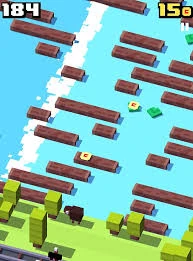
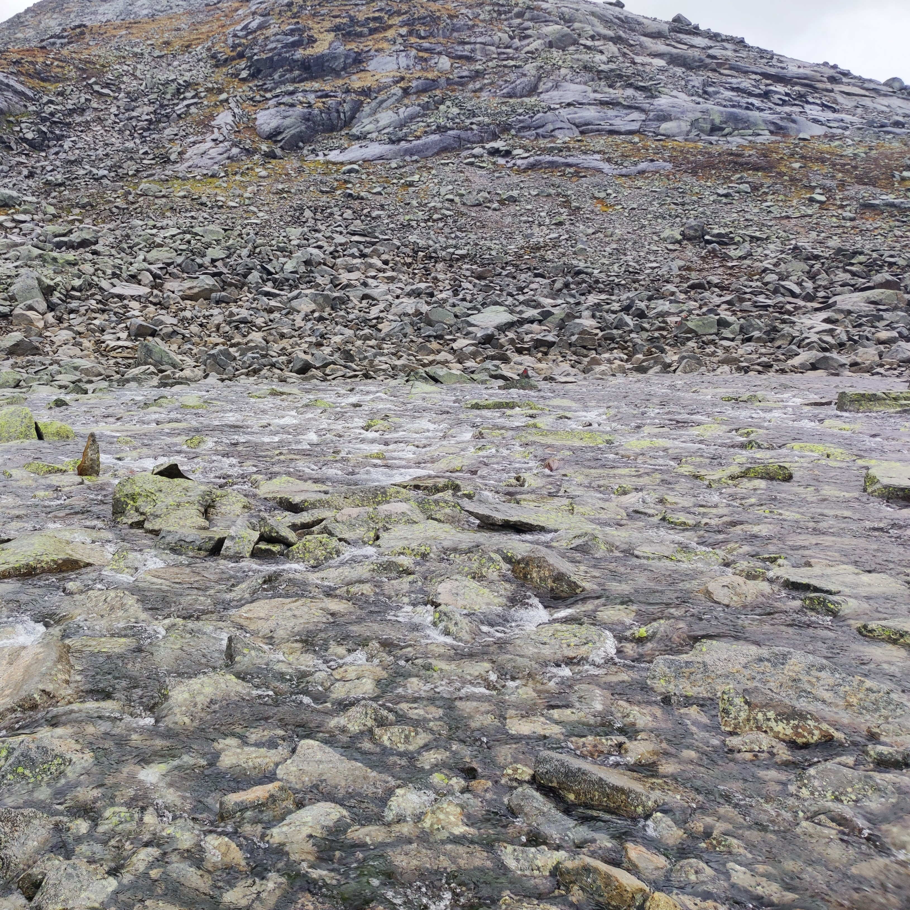
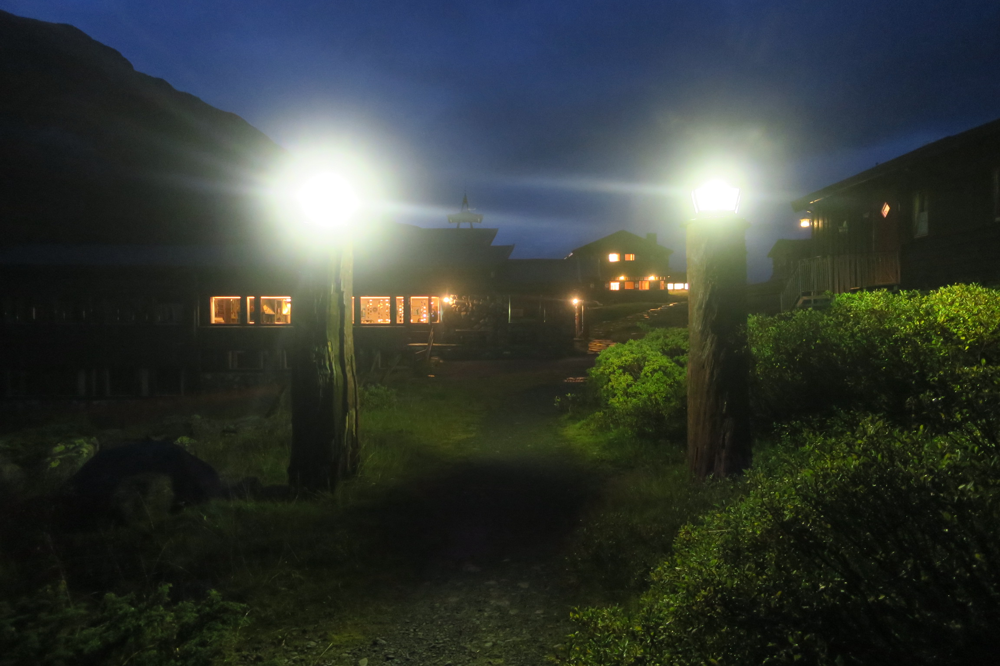
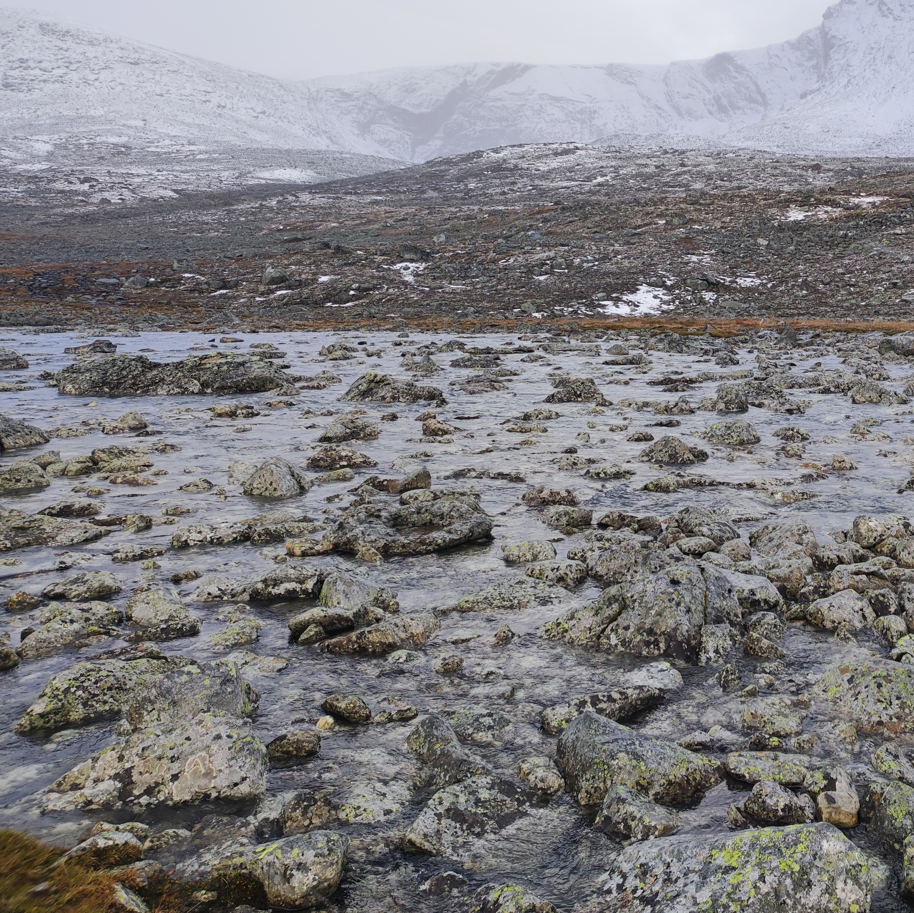

# Špecifikácia hry - Crossy River

## Opis hry 

Bude sa jendať o 3D skákačku s pohĺadom z tretej osoby. Hráč bude reprezentovaný jednoduchou postavou s batohom na chrbte. Bude sa pohybovať v horskom údolí ktoré budú pretínať rieky a bažiny prípadne iné plochy vody. Pointa hry je sa dostať cez čo najviac levelov bez smrti. 

V mape sa teda budú striedať dva mody:

- pohodový chodníček horským udolím   
- rieka, potok, bažina = prekážky 
  
  
Hráč sa bude musieť dostať cez prekážky. Jedna prekážka znamená jeden level (jedna rieka = jeden level). Cez prekažky sa bude vedieť dostať skákaním z kameňa na kameň, pripadne z kuska zeme na iný kusok zeme alebo iná kombinácia. Niekedy môže byť cez cašť prekažky most.

Ak sa hráčový nepodarí dobre skočiť a skončí vo vode alebo skočí na mokrý kus zeme alebo mokrý kameň tak sa namočí. 

Hráč má dve základné charakteristiky:

- level mokrosti hráča  
- životy hráča  

Ak sa hráč namočí tak sa mu zvyšuje level mokrosti. Čím vyšši level mokrosti, tým rýchlejšie sa hráčovy uberajú životy. Ak sa životy hráča dostanú na nulu umrel a hra sa končí. Hráč potom začína od začiatku. 

Počas prechodu údolím vie hráč stretnúť rôzne veci:

- snack - item ktorý dopĺňa životy  
- oblečenie - item ktorý zníži vlhkosť - zmena vzhľadu hrača  
- legendary, epic, rare, common item - item ktorý sa bude dať predať za nejakú sumu   
- Heim - miesto kde hráč vie predať itemi a vyresetuje sa mu vlhkosť  
  - vie si tu aj zaplatit za hernú menu Drying room - checkpoint  
    - ak umrie začína odtiaľto  
    - ak umrie druhý krát už ide od začiatku  

Zároveň sa aj mení počasie, môže snežiť, pršať alebo svietiť slnko.  Všetky tieto zmeny počasia ovplyvňuju vlhkosť a životy hráča a aj vzhľad mapy a náročnosť prekážok

Hra bude mať aj základné menu kde si hráč bude vybrať jeden zo skinov na postavu.

## Technické špecifikácie

- Vypisovanie informácií v HUD
- Herný objekt ovládaný hráčom
- Jednoduchý herný inventár
- Jednoduchý dialógový systém
- Zbieranie alebo vykladanie objektov
- Jednoduché obchodovanie
- Proceduralne generovanie niektorého aspektu hry
- Použitie časticových systémov
- Dynamické prostredie
  
## Inšpirácia

--------------------
## Bonus - ako to vzniklo (netreba čítať, len pre pobavenie)
Tento nápad vznikol keď sme sa ako traja kamoši vydali na trek do Nórskeho Jottunheimu. Hra je inšpirovaná činnosťou ktorá bola častokrát náplňou našich dní. Dosť pršalo a turistické chodníky tu nie sú udržiavané. Preto sa malé potôčiky ktoré častokrát pretínali náš chodník zmenili na rozvodnené potoky, cez ktoré sa dalo dostať len skákaním cez kamene. Chodník viedol aj cez pár velkých riek, ktoré sú za sucha určite v pohode prejditeľné, avšak teraz boli maximálne rozvodnené. Takže pri tomto krkolomnom skákaní a brodení vznikol nápad a soundtrack k tejto hre. 